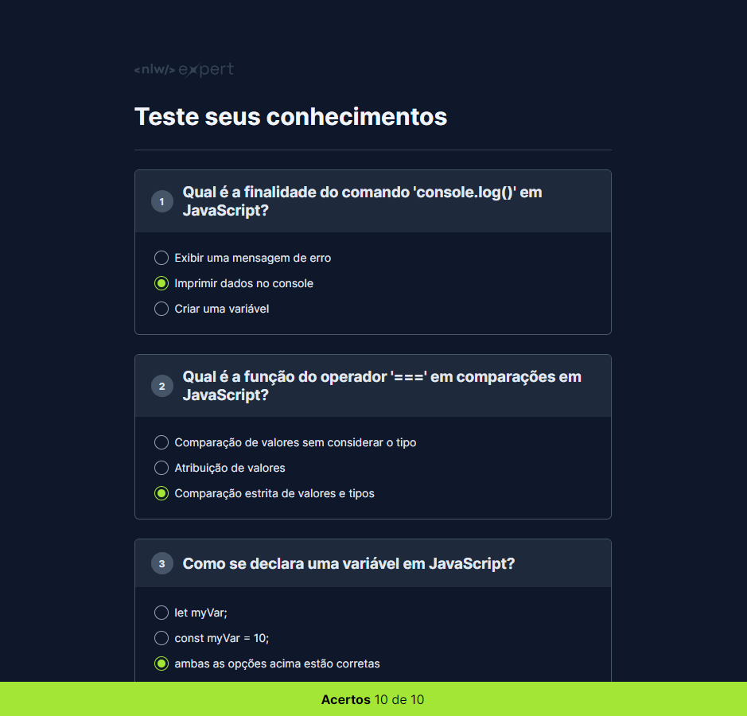

  

Aplicação desenvolvida no NLW Expert da Rocketseat na trilha HTML+CSS+JS.

  <a href="#-tecnologias">Tecnologias</a>&nbsp;&nbsp;&nbsp;|&nbsp;&nbsp;&nbsp;
  <a href="#-projeto">Projeto</a>&nbsp;&nbsp;&nbsp;&nbsp;&nbsp;&nbsp;

 

  

## 🚀 Tecnologias

Esse projeto foi desenvolvido com as seguintes tecnologias:

- HTML
- CSS
- JavaScript

## 💻 Projeto

Nesse projeto foi desenvolvido um quiz pra testar os seus conhecimentos técnicos e ter um retorno sobre a quantidade de questões que você acertou.

